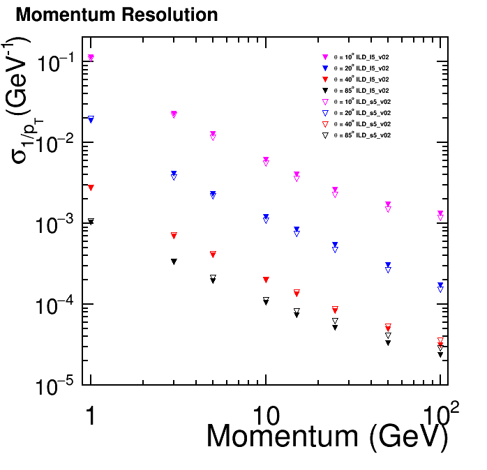
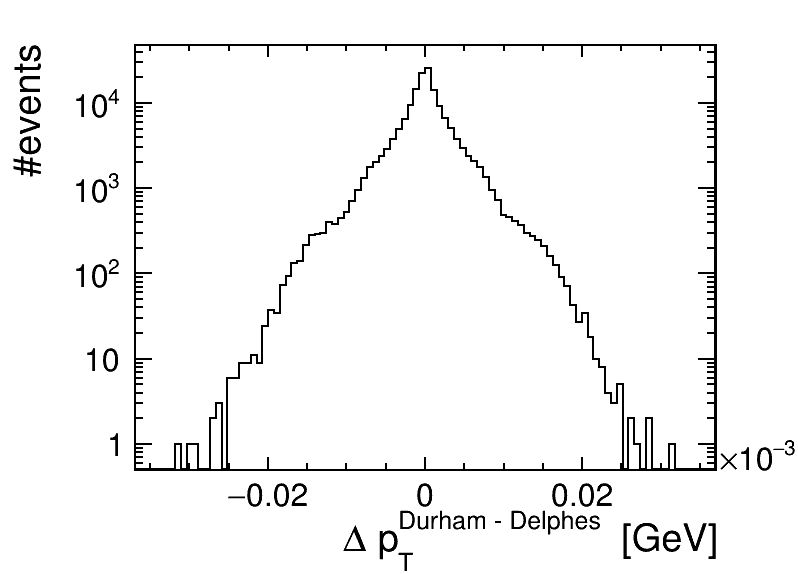

# ILCDelphes/doc/Model.md
### Description of the generic ILC detector model 

Description of the detector geometry is significantly simplified 
in Delphes. All components are assumed to have projective geometry
and are described in angular coordinates (&eta;,&phi;).

### Calorimeters

Calorimeter system is divided into 5 components 
covering following angular ranges

| &vert;&eta;&vert; coverage | EM  | HAD |
| -------------  | --- | --- |
| Central    | ECAL: &nbsp; &nbsp; &nbsp; up to 3.0  | HCAL: &nbsp; up to 2.8 |
| Forward    | LumiCal: &nbsp; 3.0 - 4.0 | LHCal: &nbsp; 2.8 - 3.8 |
| BeamCal    | &nbsp; &nbsp; &nbsp; &nbsp; &nbsp; &nbsp; &nbsp; &nbsp; &nbsp; 4.0 - 5.8 |           |

Calorimeter response is smeared with an energy spread given by a formula:

&nbsp; &nbsp; &nbsp; 
&nbsp; &nbsp; &nbsp; 
&sigma;&sup2; =  E&sup2; &sdot; A&sup2;  +   E &sdot; B&sup2; 

where the assumed values for A and B are given below 
(based on calorimeter test results).
The energy thresholds included in the table apply to smeared energy deposits
in single calorimeter tower defined in Delphes.

| Calorimeter |  A  |  B  |  Energy threshold |
| ----------- | --- | --- | ----------------- |
| ECAL        | 0.01  | 0.17 | 0.1 GeV         |
| HCAL        | 0.017 | 0.45 | 0.25 GeV        |
| LumiCal     | 0.01  | 0.17 | 2 GeV         |
| LHCAL       | 0.017 | 0.45 | 2 GeV        |
| BeamCal for &vert;&eta;&vert;<4.8 | 0.02  | 0.30 | 5 GeV        |
| BeamCal for &vert;&eta;&vert;>4.8 | 0.03  | 0.45 | 5 GeV        |

Deposits in central (ECAL and HCAL) and forward (LumiCal and LHCal) 
calorimeters are included in particle flow reconstruction. 

As there are no hadronic calorimeter behind BeamCal, only electrons, photons
and &pi;&deg; are measured. BeamCal deposits (always classified as photons by 
Delphes, as BeamCal is outside of the tracking acceptance) are stored in 
a separate output branch/collection and are not included in particle flow 
or jet clustering.

### Tracking detectors

For the tracking detectors, the acceptance is assumed to extends up to |&eta;|=3. 
Track momentum smearing is based on the parametrisation of 
[ILD IDR](https://arxiv.org/abs/2003.01116) results. Same resolution is
assumed for electrons, muons and other charged particles:

### Particle flow ###

"Particle Flow" is the approach to event reconstruction assumed in the ILC
experiments. With very high calorimeter granularity and very precise tracking,
we try to measure energy and momentum particle by particle. For charged 
particles, momentum is reconstructed in the tracking detectors much
more precisely (except for highest energy particles at low angles) than the energy
in calorimeters. Therefore, we use tracking information to reconstruct all charged
particles, while the calorimeter information is only used for neutral ones. 
Particle flow reconstruction in Delphes can be described by the following steps:

1. All reconstructed **tracks** are considered as particle flow objects (PFOs)  
1. Energy deposits in EM calorimeters (except for BeamCal), not matched to any track, 
are considered **photons**
1. Energy deposits in HAD calorimeters, not matched to any track, 
are classified as **neutral hadrons**
1. **Particle Flow Object** collection is built from all reconstructed 
tracks, photons and neutral hadrons.
1. Electron tracks (selected based on true particle ID), if passing isolation 
criteria and reconstruction efficiency cut, are stored as **isolated electrons**
1. Muon tracks (selected based on true particle ID), if passing isolation 
criteria and reconstruction efficiency cut, are stored as **isolated muon**
1. PFO photons, if passing isolation criteria and reconstruction efficiency cut,
are stored as **isolated photons**
1. Remaining PFOs (after removing isolated electrons, muons and photons) 
are a subject to **jet clustering** (see below).

Output data from Delphes include simulation results on two levels:

- particle flow objects
- final reconstruction results (isolated electrons, muons, photons and jets)

Make sure, when using objects from both levels, that there is no double counting, 
as the complete final state is described at both levels. For more details see 
[output data structure](Data.md) description.

### Jet clustering ###

Durham (ee_kt_algorithm in FastJet) is not implemented in Delphes.
However, exclusive clustering results can be exactly reproduced with 
proper settings of the VLC algorithm (R=2, &beta;=1, &gamma;=0). 
Exclusive clustering is run for N=2...6.

Comparison of jet transverse momenta from Delphes (configured VLC algorithm) 
and from external FastJet clustering with Durham algorithm,
for e+e-&rarr;qq events and exclusive 
clustering into two jets:

Inclusive jet clustering is also included for compatibility with old ILC
detector models. Anti-kt algorithm is used with R=1 and 
pTmin= 5 GeV.

For details of the jet clustering algorithms, please refer to
[FastJet](http://fastjet.fr/) documentation.

