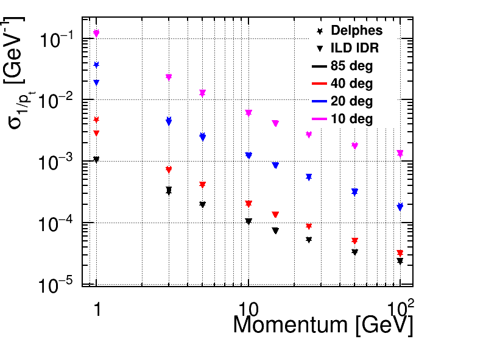
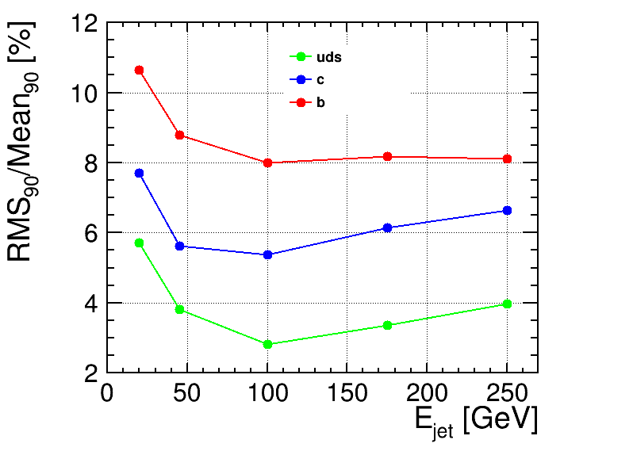
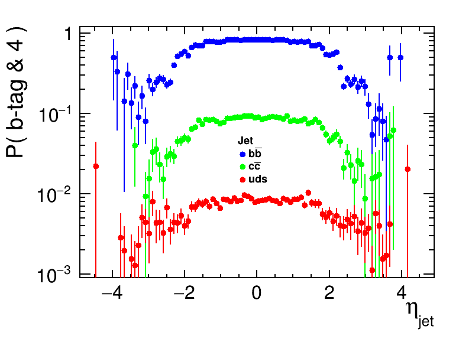
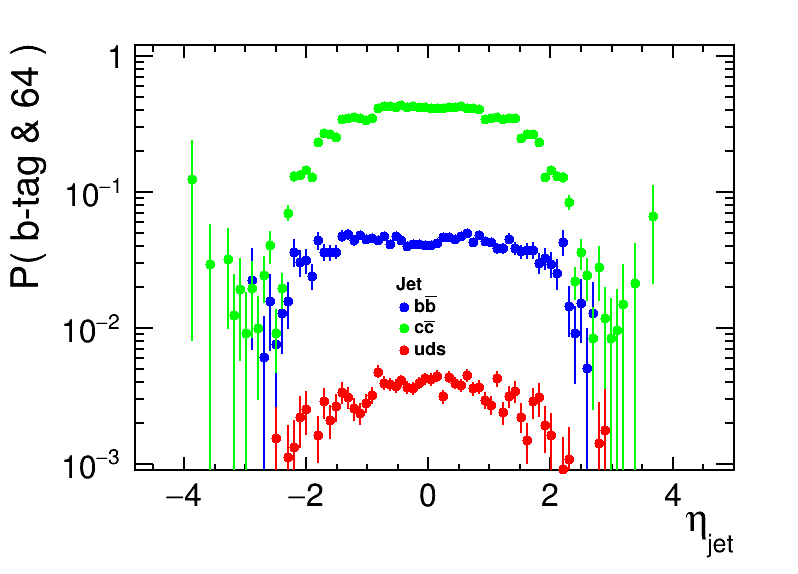
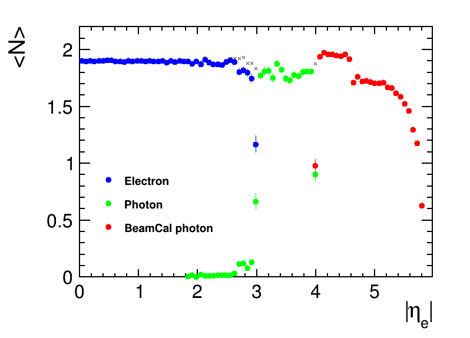

# ILCDelphes/doc/Validation.md

Only selected validation results are presented here, showing 
main performance aspects of the model. 

### Track momentum resolution

Momentum resolution for isolated muons: 
Delphes simulation results compared with results presented in 
[ILD IDR](https://arxiv.org/abs/2003.01116)

### Jet energy resolution 

Jet energy resolution for exclusive Durham clustering into two jets, 
for e+e-&rarr;qq events and different flavours of produced primary quarks.

### Flavour tagging

Probability of passing tight b-tag selection for jets resulting from different quark flavours, 
for e+e-&rarr;qq events and exclusive Durham clustering into two jets.

Probability of passing tight c-tag selection for jets resulting from different quark flavours, 
for e+e-&rarr;qq events and exclusive Durham clustering into two jets.

### Detector acceptance

Average number of reconstructed final state objects 
for e+e-&rarr;e+e- events at 250 GeV, 
as a function of electron direction. Note that electrons are reconstructed as 
photons when outside tracking detector acceptance. BeamCal photons are stored in a
separate output branch/collection and are not included in particle flow or 
jet clustering.

